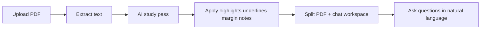

# FratNotes

**Upload a class PDF you don't understand. AI reads it like you would** — highlighting key ideas, underlining formulas and dates, scribbling margin notes, and explaining hard parts in plain language.

> **Status:** Active development — the core upload → annotate → chat flow works locally. User accounts, export, and some integrations are still in progress.

FratNotes is for high school students, college students, or anyone wrestling with dense course material: lecture slides, textbook chapters, problem sets, study guides. Instead of dumping a PDF into a chat box and hoping for the best, FratNotes marks up the document the way a real student would — color-coded highlights, underlines, margin notes — then lets you ask questions in a split-screen workspace with the PDF on one side and a Study Buddy chat on the other.

Select text in the PDF to quick-explain a passage. Pick a chat voice or language (casual study-buddy tone, Spanish, French, and more) to get explanations that match how you learn.

## How it works



1. **Upload** a text-based PDF (up to 10 MB).
2. **Extract** readable text from the document.
3. **Study pass** — AI analyzes the content and returns structured annotations: highlights, underlines, and margin notes with a color legend.
4. **Workspace** — view the marked-up PDF alongside a chat panel.
5. **Chat** — ask about anything in the document; get natural-language explanations grounded in what you uploaded.

## Features

### Works today

- **PDF upload** — text-based PDFs up to 10 MB
- **AI study pass** — automatic highlights, underlines, and margin notes with a color-coded legend
- **Interactive PDF viewer** — EmbedPDF viewer with annotation tools
- **Study Buddy chat** — per-document Q&A powered by OpenAI or local Ollama
- **Chat voices & languages** — casual study-buddy tone plus multiple languages
- **Document library** — dashboard to browse and manage your uploads
- **Guest mode** — try the app without signing in
- **Optional Open Paper bridge** — library-wide search and "Ask library" chat when the Open Paper backend is running ([`docs/OPENPAPER.md`](docs/OPENPAPER.md))

### In progress

- **Full user accounts** — Google OAuth is wired up in code, but the UI still defaults to guest mode
- **PDF export** — export component exists but is not yet integrated into the workspace
- **Freehand drawing** — drawing overlay built but not yet wired into the main UI
- **In-document editor** — BlockNote dependencies installed; editor UI not yet connected
- **Open Paper highlight sync** — bi-directional sync with Open Paper highlights is not implemented
- **Demo screenshots & hosted demo** — coming soon

## Quick start

```bash
npm install
cp .env.example .env
npm run db:push
npm run dev
```

Open [http://localhost:3001](http://localhost:3001), drop a PDF, and wait for the study pass to finish.

### AI setup

FratNotes needs an AI provider for the study pass and chat. Add one of these to `.env`:

| Provider | What to set | Notes |
|----------|-------------|-------|
| **OpenAI** (recommended) | `OPENAI_API_KEY` | Best reliability for structured JSON study-pass output. Optional `OPENAI_BASE_URL` for OpenRouter or other OpenAI-compatible APIs. |
| **Ollama** (local) | `AI_PROVIDER=ollama` and `OLLAMA_MODEL=llama3.1:8b` | Run `ollama pull llama3.1:8b` first. Works offline with no API key. |

See [`.env.example`](.env.example) for all options. The full env schema is in [`src/env.js`](src/env.js).

### Requirements

- Node.js 20+
- npm

Scanned/image-only PDFs without extractable text are not supported yet — use a text-based PDF.

## Tech stack

- **Frontend:** Next.js 15, React 19, Tailwind CSS 4, Motion
- **Backend:** Next.js API routes + tRPC 11
- **Database:** Prisma + SQLite (local dev)
- **PDF:** EmbedPDF viewer; `pdf-parse` for text extraction
- **AI:** Vercel AI SDK — OpenAI or Ollama
- **Auth:** NextAuth 5 with Google (optional)

## Development

### Environment variables

| Variable | Required | Purpose |
|----------|----------|---------|
| `DATABASE_URL` | Yes | SQLite path, e.g. `file:./db.sqlite` |
| `OPENAI_API_KEY` | For OpenAI | API key for study pass + chat (recommended) |
| `OPENAI_MODEL` | No | Model id, default `gpt-4o-mini` |
| `OPENAI_BASE_URL` | No | OpenRouter or other OpenAI-compatible endpoint |
| `AI_PROVIDER` | No | Set to `ollama` to use local Ollama instead of OpenAI |
| `OLLAMA_MODEL` | For Ollama | e.g. `llama3.1:8b` |
| `OLLAMA_BASE_URL` | No | Defaults to `http://127.0.0.1:11434` in dev |
| `AUTH_SECRET` | Production | NextAuth secret (`npx auth secret`) |
| `AUTH_GOOGLE_ID` | Optional | Google OAuth client id |
| `AUTH_GOOGLE_SECRET` | Optional | Google OAuth client secret |
| `OPENPAPER_ENABLED` | Optional | `true` to enable Open Paper proxy |
| `OPENPAPER_API_URL` | Optional | Open Paper API base URL |
| `NEXT_PUBLIC_OPENPAPER_ENABLED` | Optional | `true` to show Open Paper UI panels |

### Scripts

| Command | Description |
|---------|-------------|
| `npm run dev` | Start dev server on port **3001** |
| `npm run dev:clean` | Clear Next.js cache, then start dev server |
| `npm run build` | Production build |
| `npm run start` | Start production server |
| `npm run db:push` | Push Prisma schema to SQLite |
| `npm run db:studio` | Open Prisma Studio |
| `npm run typecheck` | Run TypeScript check |

### Project structure

| Path | Purpose |
|------|---------|
| `src/app/` | Next.js App Router pages and API routes |
| `src/app/api/upload/` | PDF upload and text extraction |
| `src/app/api/ai/` | Study pass and chat endpoints |
| `src/app/notes/[id]/` | Split PDF + chat workspace |
| `src/components/` | UI components (viewer, chatbot, navbar) |
| `src/lib/` | AI prompts, annotation schema, PDF helpers |
| `src/server/` | tRPC routers, auth, Open Paper proxy |
| `prisma/` | Database schema (SQLite) |
| `docs/OPENPAPER.md` | Optional Open Paper backend integration |

## Optional: Open Paper integration

FratNotes can connect to a running [Open Paper](https://github.com/khoj-ai/openpaper) FastAPI server for library-wide "Ask" chat, corpus search, and AI paper briefs. This is entirely optional — FratNotes works standalone with local PDFs and SQLite storage. See [`docs/OPENPAPER.md`](docs/OPENPAPER.md).

## Contributing

FratNotes is under active development. Issues and pull requests are welcome.
